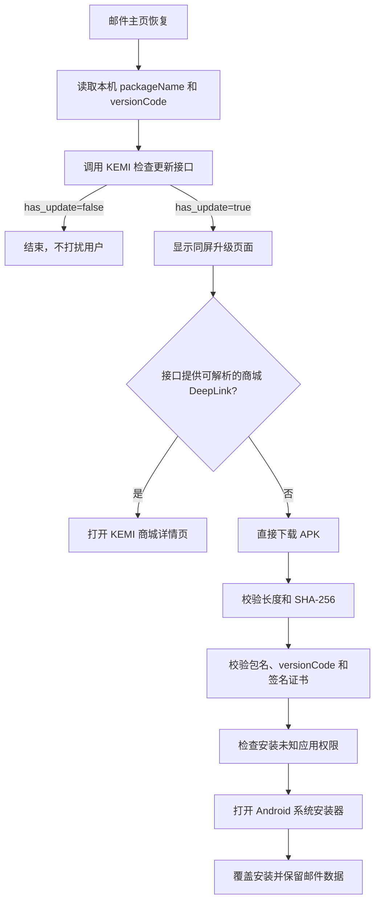

# KEMI Mail Android 自升级开发、发布与验收指南

本文是 KEMI Mail Android 自升级功能的独立操作手册，覆盖客户端实现、版本构建、开发者平台/商城配置、
版本上传、USB ADB 双屏真机验收、回滚与故障排查。文末提供可直接交给 AI 的任务模板。

本文使用示例服务地址介绍操作流程，不记录账号、密码、Token、签名口令、私钥或会话信息。
`updates.example.com` 不是可运行的服务；执行前必须替换为自己部署的服务地址。应用当前运行地址以构建配置为准。

## 1. 适用范围与当前约定

|        项目        |                  值                   |
|------------------|--------------------------------------|
| 应用名称             | KEMI 邮箱 / KEMI Mail                  |
| Android 包名       | `com.fsck.k9`                        |
| 构建模块             | `:app-k9mail`                        |
| KEMI 商店 API      | `https://updates.example.com/kd-api` |
| KEMI 开发者平台       | `https://updates.example.com/kd`     |
| KEMI 商城包名        | `com.newlink.featuredapps`           |
| 系统安装器包名          | `com.android.packageinstaller`       |
| 开发者平台应用记录        | 使用自己的应用 ID；可选择仅自升级、不在商城展示            |
| 2026-08-21 已验证升级 | `20.1 (39040)` → `20.2 (39041)`      |

正式发布前必须以开发者平台和 Git 中的实际状态为准，不能只依赖上表中的历史记录。

## 2. 工作原理



检查更新接口：

```http
GET https://updates.example.com/kd-api/api/store/update/check?package_name=com.fsck.k9&version_code={本机版本号}
```

接口公开，无需登录或 Token。服务端只有在以下条件全部满足时才返回更新：

1. 应用处于已上架状态；
2. APK 下载地址有效；
3. 远端 `version_code` 严格大于客户端版本；
4. 包名与请求一致。

“仅自升级（不展示）”仍属于已上架状态，但 `list_in_store=false`、`deeplink` 为空，不会出现在商城列表，
客户端会直接下载 APK。

## 3. 客户端实现

当前实现已在提交 `53c168ab4e` 中完成。以后重做、迁移或审查时，至少核对以下文件：

|                                                       文件                                                        |                          职责                          |
|-----------------------------------------------------------------------------------------------------------------|------------------------------------------------------|
| [`app-k9mail/build.gradle.kts`](../../app-k9mail/build.gradle.kts)                                              | 版本号、API 根地址和 KEMI 构建配置                               |
| [`K9App.kt`](../../app-k9mail/src/main/kotlin/app/k9mail/K9App.kt)                                              | 应用启动时注册升级协调器                                         |
| [`KemiAppUpdateCoordinator.kt`](../../app-k9mail/src/main/kotlin/app/k9mail/update/KemiAppUpdateCoordinator.kt) | 邮件主页恢复后每进程检查一次，并从当前 Activity 启动升级页                   |
| [`KemiAppUpdateRepository.kt`](../../app-k9mail/src/main/kotlin/app/k9mail/update/KemiAppUpdateRepository.kt)   | 调接口、解析响应、下载和长度限制                                     |
| [`KemiAppUpdateVerifier.kt`](../../app-k9mail/src/main/kotlin/app/k9mail/update/KemiAppUpdateVerifier.kt)       | SHA-256、包名、版本号和签名校验                                  |
| [`KemiAppUpdateInstaller.kt`](../../app-k9mail/src/main/kotlin/app/k9mail/update/KemiAppUpdateInstaller.kt)     | 商城 DeepLink、未知来源权限和系统安装器                             |
| [`KemiAppUpdateActivity.kt`](../../app-k9mail/src/main/kotlin/app/k9mail/update/KemiAppUpdateActivity.kt)       | 升级页面和系统页面结果处理                                        |
| [`KemiAppUpdateScreen.kt`](../../app-k9mail/src/main/kotlin/app/k9mail/update/KemiAppUpdateScreen.kt)           | 可取消/强制更新 UI、进度和错误状态                                  |
| [`AndroidManifest.xml`](../../app-k9mail/src/main/AndroidManifest.xml)                                          | `REQUEST_INSTALL_PACKAGES`、Activity、查询和 FileProvider |
| [`kemi_self_update_paths.xml`](../../app-k9mail/src/main/res/xml/kemi_self_update_paths.xml)                    | 只暴露升级缓存目录给系统安装器                                      |

### 3.1 必须保留的安全规则

当前实现比官方示例更严格，后续修改不能降低这些校验：

- 检查接口、跳转后的响应地址和 APK 地址必须使用 HTTPS；
- 检查接口响应最大 256 KiB；
- APK 最大 250 MiB；
- 服务端必须提供格式正确的 64 位小写 SHA-256；
- 实际下载长度必须与 HTTP 或接口长度一致；
- APK 包名必须同时匹配已安装应用和接口包名；
- APK `versionCode` 必须匹配接口且高于已安装版本；
- 新 APK 与已安装 APK 必须存在相同的签名证书摘要；
- FileProvider 只允许访问 `cache/self-update/`；
- 不记录邮箱地址、邮件内容、凭据或认证 Token。

### 3.2 双屏行为

升级页由当前 `MessageHomeActivity` 直接启动，因此应继承当前 Activity 所在的 Android `Display`，不能通过
Application Context 加 `FLAG_ACTIVITY_NEW_TASK` 随机创建到另一屏。

双屏页面、菜单和弹窗的一般规则见
[`kemi-dual-screen-ui-guide.md`](kemi-dual-screen-ui-guide.md)。升级测试时必须通过任务栈确认主页和升级页位于
同一个 `Display`。

### 3.3 首个可自升级基线

旧版本如果没有上述升级代码，它不可能凭空获得自升级能力。第一次启用时必须通过 USB、预装流程或商城手动安装一个
“已经包含升级器”的基线版本。之后才能从该基线在线升级。

只看到服务端 `has_update=true`，但旧 APK 内没有 `KemiAppUpdateActivity`，不会弹出升级页。这不是接口故障。

## 4. 准备新版本

### 4.1 检查工作区和当前线上版本

```shell
git status --short --branch
git log -5 --oneline

curl -fsS \
  "https://updates.example.com/kd-api/api/store/update/check?package_name=com.fsck.k9&version_code=0"
```

在开发者平台同时查看 `控制台 → 应用管理 → KEMI 邮箱` 的线上版本。不要只根据本地构建目录判断线上版本。

### 4.2 修改并提交版本号

在 [`app-k9mail/build.gradle.kts`](../../app-k9mail/build.gradle.kts) 中修改：

```kotlin
val kemiVersionCode = 39042
val kemiVersionName = "20.3"
```

规则：

- `kemiVersionCode` 必须是从未发布过、且严格高于线上版本的整数；
- `kemiVersionName` 是用户可见版本名；
- 正式发布的版本号必须写回源码并提交；
- 不允许只临时改版本构建、随后恢复源码却把该 APK 留在线上，否则 Git 无法复现线上产物；
- 不允许上传相同或更低 `versionCode` 的 APK；
- 不能通过卸载正式应用解决签名或版本冲突，因为这可能清除邮件数据。

版本号变更应与发布内容一起进入 Conventional Commit。不要提交构建产物或签名材料。

### 4.3 运行验证

功能修改至少执行：

```shell
export JAVA_HOME=/path/to/jdk-21
export ANDROID_HOME=/path/to/Android/sdk

./gradlew :app-k9mail:testKemiDebugUnitTest
./gradlew lint detekt spotlessCheck
```

正式候选还必须遵守：

- [`kemi-security-release-gates.md`](../release/kemi-security-release-gates.md)
- [`kemi-regression-matrix.md`](../release/kemi-regression-matrix.md)
- [`kemi-release-evidence-template.md`](../release/kemi-release-evidence-template.md)

## 5. 构建 APK

标准入口定义在 [`app-k9mail/README.md`](../../app-k9mail/README.md)。

### 5.1 本地功能测试包

```shell
./gradlew :app-k9mail:kemiDebugApk
```

输出：

```text
app-k9mail/build/outputs/kemi/debug/KEMI-Mail-v<version>-debug.apk
```

Debug 包的 application ID 带 `.debug`，不能覆盖安装正式的 `com.fsck.k9`，也不能上传为正式自升级版本。

### 5.2 正式签名发布包

```shell
./gradlew :app-k9mail:kemiReleaseApk
```

输出：

```text
app-k9mail/build/outputs/kemi/release/KEMI-Mail-v<version>.apk
```

正式构建需要本机受控的 `.signing/k9.release.signing.properties` 和 KEMI keystore。它们不得进入 Git、文档、
日志、聊天或开发者平台的文本字段。若缺少正式签名配置，应停止发布；不能把 Debug APK 改名冒充正式包。

### 5.3 构建后校验

```shell
APK="app-k9mail/build/outputs/kemi/release/KEMI-Mail-v<version>.apk"
BUILD_TOOLS="$ANDROID_HOME/build-tools/35.0.0"

"$BUILD_TOOLS/aapt" dump badging "$APK" | head -1
"$BUILD_TOOLS/apksigner" verify --print-certs "$APK"
sha256sum "$APK"
```

必须确认：

- package 为 `com.fsck.k9`；
- `versionCode` 和 `versionName` 等于源码中的新值；
- APK 签名证书 SHA-256 与已安装正式版一致；
- 记录 APK 文件 SHA-256，用于上传后比对；
- APK 能在不清数据的情况下通过 `adb install -r` 覆盖旧正式版。

## 6. 首次在开发者平台创建应用

只有 `com.fsck.k9` 还不存在时才执行本节。已有应用必须使用“提交新版本”，不能重复创建或删除重建。

1. 登录 `https://updates.example.com/kd`；
2. 打开 `控制台 → 应用管理 → 新建应用`；
3. 平台选择“安卓”；
4. 上传正式签名 APK；
5. 等待服务端解析包名、版本、大小、图标和 SHA-256；
6. 核对应用名称和包名；
7. 支持平台选择“双屏”；
8. 商城展示选择“仅自升级（不展示）”；
9. 首次测试选择“可取消”，不要直接启用强制更新；
10. 填写一句话简介、详细描述和更新说明；
11. 点击“保存并上架”；
12. 记录应用 ID，并立即用公开接口验证。

“仅自升级”不会进入商城列表或审核队列，但已上架期间所有旧版 `com.fsck.k9` 客户端都可能检测到它。
测试窗口应尽量短；如果不是正式发布，验收后立即下架。

## 7. 为已有应用提交新版本

当前应用已经存在，正常发布应执行：

1. 打开 `控制台 → 应用管理 → 安卓`；
2. 找到包名为 `com.fsck.k9` 的“KEMI 邮箱”；
3. 进入详情页，点击“提交新版本”；
4. 上传新正式签名 APK；
5. 等待解析完成；
6. 核对服务端显示的 package、`versionName`、`versionCode`、文件大小和 SHA-256；
7. 填写本次更新说明；
8. 保持“仅自升级（不展示）”；
9. 根据发布决策选择“可取消”或“强制更新”；
10. 提交并上架；
11. 使用下一节的接口检查确认结果。

### 7.1 可取消与强制更新

- “可取消”：用户可以稍后更新，适合首次验证和普通版本；
- “强制更新”：升级页不可关闭，会阻断主流程，只能在明确获批并完成兼容性验证后使用；
- 强制更新会影响所有命中该版本条件的客户端，不能只为了方便测试临时打开。

## 8. 发布后接口检查

假设旧版本是 `39040`，新版本是 `39041`：

```shell
curl -fsS \
  "https://updates.example.com/kd-api/api/store/update/check?package_name=com.fsck.k9&version_code=39040"

curl -fsS \
  "https://updates.example.com/kd-api/api/store/update/check?package_name=com.fsck.k9&version_code=39041"
```

旧版本请求必须满足：

- `has_update=true`；
- package 为 `com.fsck.k9`；
- 远端版本是本次新版本；
- `apk_url` 使用 HTTPS；
- `apk_sha256` 与本地 APK 完全一致；
- `file_size_bytes` 与本地文件一致；
- 仅自升级时 `list_in_store=false`、`deeplink=""`；
- `force_update` 与后台选择一致。

新版本请求必须返回 `has_update=false`。

## 9. USB ADB 双屏端到端验收

### 9.1 连接和基线

当电脑同时连接多台 Android 设备时，每条命令都必须带 KEMI 设备序列号，避免安装到手机：

```shell
adb devices -l
SERIAL="<KEMI 设备序列号>"

adb -s "$SERIAL" shell dumpsys package com.fsck.k9 \
  | grep -E 'versionCode=|versionName='
adb -s "$SERIAL" shell dumpsys display
```

确认：

- 设备状态为 `device`；
- 上下两个 Display 都是 `ON`；
- 基线版本低于服务器版本；
- 基线 APK 已经包含自升级实现；
- 测试前记录账户数量和关键设置，但不要输出账户标识或邮件内容。

### 9.2 验证签名兼容

```shell
INSTALLED_APK_PATH="$(
  adb -s "$SERIAL" shell pm path com.fsck.k9 | sed 's/package://'
)"

adb -s "$SERIAL" pull "$INSTALLED_APK_PATH" /tmp/kemi-installed.apk
"$BUILD_TOOLS/apksigner" verify --print-certs /tmp/kemi-installed.apk
"$BUILD_TOOLS/apksigner" verify --print-certs "$APK"
```

两个证书 SHA-256 必须一致。

### 9.3 启动并检查升级页屏幕归属

```shell
adb -s "$SERIAL" shell am force-stop com.fsck.k9
adb -s "$SERIAL" shell am start --display 0 \
  -n com.fsck.k9/net.thunderbird.app.common.MainActivity

adb -s "$SERIAL" shell dumpsys activity activities \
  | grep -E 'Display #|KemiAppUpdateActivity|MessageHomeActivity|mResumedActivity'
```

预期：

- `MessageHomeActivity` 和 `KemiAppUpdateActivity` 位于同一个 Display/Task；
- 从上屏主页触发时升级页在上屏，从下屏主页触发时在下屏；
- 不出现一块屏点击、另一块屏弹出的情况；
- 可取消更新能返回邮件主页；
- 强制更新不能通过返回键绕过。

部分 KEMI 固件把物理显示标记为安全显示，ADB `screencap` 可能只得到空白或不完整画面。此时使用人工目视确认，
并用 `dumpsys activity activities` 保存 Display/Task 归属证据。不要用 `am stack move-task` 强行迁移应用任务；
已验证某些固件会在系统 WindowManager 内抛出 `ClassCastException`，这不是应用可依赖的测试方式。

### 9.4 下载、授权和安装

在升级页点击“立即更新”，依次确认：

1. 显示下载进度；
2. 下载完成后没有 SHA-256、包名、版本或签名错误；
3. Android 8+ 首次使用时进入“允许来自此来源的应用”页面；
4. 授权返回后继续打开 `com.android.packageinstaller`；
5. 系统显示“更新”而不是新装另一个应用；
6. 安装完成且没有丢失账户、设置、草稿和本地缓存。

不要使用 `adb install` 代替这一段，否则无法证明客户端下载、FileProvider、未知来源授权和系统安装器链路正常。

### 9.5 安装后闭环

```shell
adb -s "$SERIAL" shell dumpsys package com.fsck.k9 \
  | grep -E 'versionCode=|versionName='

adb -s "$SERIAL" shell am force-stop com.fsck.k9
adb -s "$SERIAL" shell am start --display 0 \
  -n com.fsck.k9/net.thunderbird.app.common.MainActivity
```

必须确认：

- 已安装版本等于新版本；
- 邮件账户和设置仍在；
- 应用可正常进入邮件主页；
- 新版本重新启动后不再弹升级页；
- 用新 `versionCode` 调接口返回 `has_update=false`；
- 无崩溃或 ANR。

## 10. 正式保留、测试下架与回滚

### 10.1 正式发布成功

保持应用“已上架 + 仅自升级”，不要删除应用记录。这样后续版本可继续使用“提交新版本”。

### 10.2 仅用于短期测试

验收后在应用详情点击“下架”，再确认旧版本请求返回 `has_update=false`。下架是可恢复操作；删除应用不是常规回滚手段。

### 10.3 发现严重问题

1. 立即下架问题版本，阻止新的客户端继续检测到更新；
2. 不要上传低 `versionCode` 试图降级，Android 不允许正常覆盖降级；
3. 修复代码并发布更高 `versionCode` 的热修复；
4. 如果误开强制更新，应先关闭强制更新或下架；
5. 不要删除应用、清除用户数据或更换签名证书；
6. 记录影响范围、时间、APK SHA-256 和处置结果，但不得记录用户邮件数据。

## 11. 常见故障

### 11.1 一直返回 `has_update=false`

按顺序检查：

1. 包名是否为 `com.fsck.k9`；
2. 应用是否已上架；
3. 是否存在有效 APK/download URL；
4. 远端 `versionCode` 是否严格大于本地；
5. 是否误把新版本号当成本地参数；
6. 是否打开了错误的同名应用记录。

### 11.2 接口有更新，但客户端不弹窗

- 确认安装的基线 APK 本身包含升级器；
- 完全结束应用进程再启动，因为当前设计每进程只检查一次；
- 确认主页真正进入 `onResume`；
- 查看是否有网络、TLS 或响应解析错误；
- 用任务栈确认升级 Activity 是否已经在另一 Display；
- 不要仅根据桌面图标或 `versionName` 猜测 APK 内容。

### 11.3 下载后校验失败

- 比较本地 APK 和接口 `apk_sha256`；
- 比较 `file_size_bytes`；
- 确认 CDN 返回的是 APK，而不是错误页面；
- 确认服务端没有仍指向旧文件；
- 确认 APK 包名、版本和签名都正确。

### 11.4 安装页打不开

- 确认清单声明 `REQUEST_INSTALL_PACKAGES`；
- 确认用户已允许 KEMI 邮箱安装未知应用；
- 确认 FileProvider authority 为 `${applicationId}.selfupdatefileprovider`；
- 确认 URI 已授权给 `com.android.packageinstaller`；
- 确认设备确实存在并能解析该系统安装器；
- 不要改用 `file://` URI。

### 11.5 ADB 突然找不到设备

```shell
adb devices -l
```

如果设备完全不在列表中，而不是 `offline`，检查 USB 线、端口、设备 USB 调试状态和授权。测试版本如果只是临时上架，
长时间阻塞时应先下架，避免影响其他旧版客户端；连接恢复后再重新上架继续测试。

### 11.6 同时连接了多台设备

绝不能依赖 `adb` 的默认目标。先读取序列号，之后所有安装、截图、`dumpsys` 和日志命令都带 `-s "$SERIAL"`。

## 12. 发布验收清单

- [ ] Git 工作区状态已检查，没有覆盖他人改动
- [ ] 新版本号已写入源码并提交
- [ ] 单元测试、lint、detekt、spotlessCheck 通过
- [ ] 正式 APK 使用受控的 KEMI 正式签名
- [ ] package、版本、签名、SHA-256 和文件大小已核对
- [ ] 开发者平台使用现有 `com.fsck.k9` 应用记录提交新版本
- [ ] 商城展示/仅自升级和强制更新设置符合发布决策
- [ ] 旧版本接口返回 `has_update=true`
- [ ] 新版本接口返回 `has_update=false`
- [ ] 上屏触发显示在上屏，下屏触发显示在下屏
- [ ] 直接下载、完整性校验、未知来源授权和系统安装器链路通过
- [ ] 覆盖安装后版本正确，账户、设置、草稿和缓存保留
- [ ] 新版本重启后不重复提示
- [ ] 正式发布保留上架；短期测试已下架
- [ ] Git 提交符合 Conventional Commits；除非明确要求，否则不 push

## 13. 可直接交给 AI 的任务模板

把尖括号内容替换为本次实际值：

```text
请在当前 KEMI Mail 仓库完成 Android 自升级版本发布和 USB 双屏端到端验收。

目标版本：<versionName> / <versionCode>
发布性质：<正式发布或短期测试>
更新策略：<可取消或强制更新>
商城策略：仅自升级（不展示）
目标包名：com.fsck.k9
开发者平台：https://updates.example.com/kd
平台文档：使用自己部署的平台文档地址

必须先完整阅读：
- AGENTS.md
- docs/developer/kemi-android-self-update-guide.md
- app-k9mail/README.md
- docs/release/kemi-security-release-gates.md
- docs/release/kemi-regression-matrix.md

执行要求：
1. 先检查 Git 状态、源码版本、线上版本、签名配置和 ADB 设备，不能猜测。
2. 正式版本号必须写入 app-k9mail/build.gradle.kts 并进入 Git，不能只临时修改。
3. 使用 :app-k9mail:kemiReleaseApk 构建正式包；缺少正式签名时停止，不得用 Debug 包冒充。
4. 校验 APK package、versionName、versionCode、签名证书、SHA-256 和大小。
5. 开发者平台已有 com.fsck.k9 时只提交新版本，不得删除重建。
6. 上传后核对公开检查接口；仅自升级应返回 list_in_store=false 和空 deeplink。
7. ADB 同时连接多台设备时，每条命令必须使用 KEMI 设备 serial。
8. 在双屏设备从旧的、已含升级器的正式基线完整测试：提示、稍后更新、下载、校验、未知来源授权、系统安装、数据保留。
9. 用 dumpsys 验证主页和升级页的 Display/Task 归属，不使用 am stack move-task 强迁移。
10. 安装后确认设备版本已升级，新版本接口 has_update=false，重启不再提示。
11. 正式发布成功则保留“已上架 + 仅自升级”；短期测试完成后下架并验证接口恢复。
12. 不输出或提交密码、Token、keystore、签名口令、用户邮箱或邮件内容。
13. 运行相关测试和质量检查，最后报告精确命令、结果、提交号、未验证项和后台最终状态。
14. 只有我明确要求时才执行 git commit；commit 不代表 push，未经要求不要 push。
```

## 14. 参考资料

- 平台接口文档：由所使用的更新服务提供方提供。
- [KEMI Mail 构建说明](../../app-k9mail/README.md)
- [KEMI 双屏 UI 投影与问题排查指南](kemi-dual-screen-ui-guide.md)
- [KEMI 安全与发布门禁](../release/kemi-security-release-gates.md)
- [KEMI 回归矩阵](../release/kemi-regression-matrix.md)
- [KEMI 发布证据模板](../release/kemi-release-evidence-template.md)

发布前请使用实际平台文档核对接口版本与参数。
