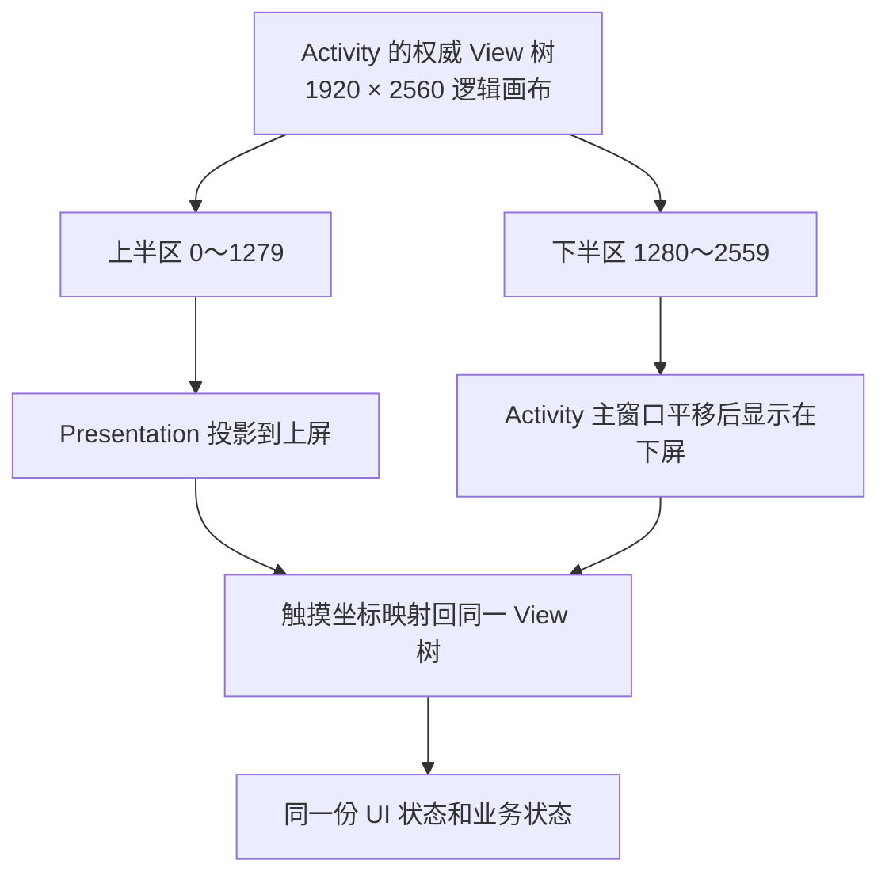

# KEMI 双屏 UI 投影与问题排查指南

本文记录 KEMI 双屏设备上 Activity、菜单、弹窗和选择器的显示模型、常见故障、修复原则与验证流程。
目标是让后续新增页面或修复类似问题时，能够先判断问题属于“页面没有参与双屏投影”还是
“临时窗口绑定到了错误的物理屏幕”，并使用同一套基础设施解决，而不是在单个页面中增加脆弱的坐标补丁。

## 1. 必须遵守的体验约束

KEMI 邮箱在受支持的双屏设备上必须满足以下约束：

1. 应用的普通全屏页面始终保持双屏工作区，页面跳转不能退化为单屏。
2. 上下物理屏幕共同显示同一个连续逻辑画布，不维护两份独立业务状态。
3. 从上屏控件打开的锚点菜单必须显示在上屏，从下屏控件打开的菜单必须显示在下屏。
4. 锚点菜单保持 `WRAP_CONTENT` 的小窗口形态，不能为了跨屏而扩展为占满整行或整屏的面板。
5. 同一组互斥菜单只能同时显示一个。打开新菜单时，旧菜单必须先消失。
6. 进入邮件、移动邮件、管理文件夹、添加附件等后续层级时，双屏状态和触摸映射必须保持连续。
7. 真正的模态对话框可以覆盖当前工作区，但不能借此销毁或替换底层双屏工作区。
8. 下屏两侧的模式与撰写悬浮按钮使用同一半透明色组，并只在贴边和向内收起两个位置间水平吸附；
   拖回边缘或使用无障碍移动动作即可还原，不能停留在遮挡内容的任意位置。

这里的“始终双屏”指应用可见工作区始终连续。没有可见内容的路由 Activity、第三方授权回调和系统提供的
外部应用界面不属于应用内部工作区，不能通过本项目的视图投影强制控制。

## 2. 为什么 Android 不会自动把两块屏幕拼起来

KEMI 硬件在 Android 中暴露为两个独立的 `Display`，而不是一个高度翻倍的系统显示区域。普通 Activity
只属于启动它的那块显示屏。Android 的 `PopupMenu`、`PopupWindow`、`Dialog` 等窗口也会附着到 Activity
所在的显示屏，不会因为锚点 View 被绘制到了另一块屏幕，就自动迁移到那块屏幕。

本项目因此使用一个“权威视图树”模拟连续画布：



关键实现位于：

- `DualScreenDeviceProfile`：描述受支持硬件的物理尺寸、逻辑尺寸、屏幕 ID、方向和触摸映射参数。
- `DualScreenDisplaySelector`：只选择符合设备白名单的副屏，避免误投影到 HDMI、投屏或其他显示设备。
- `DualScreenRuntimeState`：根据用户设置和副屏可用性解析单屏、沉浸或智能模式。
- `DualScreenSpanCoordinator`：创建上屏 `Presentation`，调整权威 View 的逻辑高度和平移，并转发触摸。
- `DualScreenActivityController`：让公共 Activity 基类只依赖生命周期接口，不依赖具体硬件实现。
- `DefaultDualScreenActivityController`：为普通全屏页面创建并管理 `DualScreenSpanCoordinator`。

## 3. 本轮问题的根因

### 3.1 页面跳转后退化为单屏

早期实现只在 `MessageHomeActivity` 和 `MessageCompose` 等少数页面中手动创建
`DualScreenSpanCoordinator`。当用户从邮件主页进入“管理文件夹”等新的 Activity 时：

1. 原 Activity 进入 `onStop()`；
2. 原 Activity 的上屏 `Presentation` 被销毁；
3. 新 Activity 只创建了默认显示屏上的普通 Window；
4. 新 Activity 没有创建自己的 `Presentation`；
5. 下屏显示新页面，上屏回到桌面或残留旧画面，看起来像应用突然变成单屏。

这是 Activity 级能力依靠手动接入造成的遗漏，不是布局高度或某个页面 XML 的局部问题。继续逐页复制初始化代码
只会在以后新增页面时再次遗漏。

### 3.2 上屏菜单跑到下屏

上屏的内容只是同一个权威 View 树经 `Presentation` 绘制出的视口。锚点 View 的逻辑位置在上半区，但原生
`PopupMenu` 创建的是独立 Window。该 Window 仍然附着在 Activity 的主显示屏，也就是下屏，所以会出现
“点击上屏右上角三个点，菜单却显示在下屏”的现象。

这个问题不能只靠给原生 PopupWindow 增加 Y 偏移解决，因为 Window 本身仍属于错误的 Display。

### 3.3 两个菜单重叠或菜单被拉成整条

如果“分类”和“更多”分别持有自己的 PopupWindow，打开第二个菜单时不会自动关闭第一个菜单，两个独立 Window
就会重叠。若为了让上屏看见内容而把一个普通容器直接铺满根布局，又会把小菜单错误地扩展成整条面板。

正确做法是由一个 Activity 级控制器统一管理当前临时菜单，并把小菜单作为 `WRAP_CONTENT` 子 View 放入权威
画布。控制器在显示新菜单前先 `dismiss()` 旧菜单，再根据锚点所在视口计算位置。

## 4. 全局 Activity 投影修复

### 4.1 公共基类自动接入

`BaseActivity` 现在统一接管普通全屏页面的投影生命周期，并覆盖三个 `setContentView()` 入口：

- `setContentView(layoutResId)`；
- `setContentView(view)`；
- `setContentView(view, layoutParams)`。

每次内容视图被建立或替换时，基类都会取得 `android.R.id.content` 下的第一个权威子 View，并通过
`DualScreenActivityControllerFactory` 创建控制器。若 Activity 已经启动，控制器立即启动；否则在
`onStart()` 中启动。

生命周期所有权必须保持对称：

- `onStart()` 调用控制器 `start()`；
- `onStop()` 调用控制器 `stop()`；
- `onDestroy()` 调用控制器 `destroy()` 并清空引用；
- 内容 View 被替换时先销毁旧控制器，再绑定新 View。

这样覆盖了继承 `BaseActivity`、`BaseListActivity` 或其他项目基类的 XML 和 Compose 页面。以后新增普通全屏
Activity 时，只要使用项目基类，就不需要再次复制双屏初始化代码。

### 4.2 为什么使用 Factory，而不是让基础模块直接依赖实现

`legacy:ui:base` 定义 `DualScreenActivityController` 和 `DualScreenActivityControllerFactory` 接口；具体实现留在
`legacy:ui:legacy`，通过 Koin 绑定。这样基础 UI 模块不需要反向依赖包含具体设备逻辑的 legacy 实现，也不会造成
模块依赖环。

新增或移动实现时，必须继续遵守这一依赖方向：

```text
legacy:ui:base
    └── 声明生命周期接口

legacy:ui:legacy
    ├── 实现接口
    ├── 依赖 DualScreenSpanCoordinator
    └── 在 KoinModule 中绑定 Factory
```

### 4.3 自动接入策略

默认策略由 `ThemeType` 决定：

- `ThemeType.DEFAULT`：普通全屏页面，自动启用双屏投影；
- `ThemeType.DIALOG`：对话框样式 Activity，不建立第二套全屏投影。

对话框样式 Activity 被排除，是为了避免一个小型确认框被错误放大成完整双屏页面。它的底层全屏 Activity
仍应继续拥有双屏工作区。

### 4.4 专用双屏页面必须显式退出自动机制

`MessageHomeActivity` 和 `MessageCompose` 已经拥有自己的双屏工作区、菜单、ActionMode、附件预览或智能布局
控制器。这些页面通过覆盖以下方法退出公共投影：

```kotlin
override fun useAutomaticDualScreenProjection(): Boolean = false
```

只有页面确实拥有完整的专用投影生命周期时才能返回 `false`。不能仅仅因为页面布局特殊或临时遇到显示问题就退出，
否则页面会重新退化为单屏。

专用页面必须自行保证：

1. 对称处理 `start`、`stop`、`destroy`；
2. 副屏断开和恢复时状态正确；
3. 上下屏触摸进入同一权威 View 树；
4. 页面内部所有临时 UI 遵循下一节的跨屏规则。

## 5. 菜单、弹窗和临时 UI 的正确选择

### 5.1 锚点小菜单

当锚点可能显示在上屏时，不能直接依赖原生 `PopupMenu` 的 Window 定位。邮件主页中的 View 菜单应先调用
`DualScreenPopupMenu.showIfNeeded()`：

1. 如果锚点属于双屏邮件主页，把可见菜单项转换为画布内的小菜单；
2. 如果当前不是双屏场景，返回 `false`，调用方继续显示原生 `PopupMenu`；
3. 菜单项点击仍回调原来的 `MenuItem` 处理逻辑。

画布内菜单由 `DualScreenAnchoredPopupController` 管理。它负责：

- 确认锚点属于权威根 View；
- 显示新菜单前关闭旧菜单；
- 约束菜单最大宽高，但保持 `WRAP_CONTENT`；
- 根据锚点中心判断锚点属于上屏还是下屏视口；
- 优先显示在锚点下方，空间不足时显示在上方；
- 把位置限制在锚点所在的单个视口内；
- 点击菜单外区域时关闭当前菜单。

不要为“分类”“更多”“发件人”“附件”等入口分别创建长期存在的 PopupWindow。一个页面应共享一个临时菜单
控制器，从结构上保证互斥。

### 5.2 ActionMode 和批量操作

原生上下文 ActionMode 也可能创建系统级浮动 Window。批量选择、全选、移动、归档等操作应优先使用
`DualScreenActionModeController`，把工具栏放在权威画布内部。这样从上屏选择邮件后，操作菜单不会跳到下屏，
也不会破坏双屏页面。

### 5.3 模态对话框

确认框、错误提示等真正的模态 UI 可以继续使用项目现有 Dialog 组件，但必须验证：

- 底层 Activity 的双屏投影没有被停止或替换；
- Dialog 关闭后上下屏内容和触摸恢复正常；
- Dialog 没有因为错误的 Match Parent 约束变成整条菜单；
- 如果 Dialog 必须与上屏锚点对齐，应改用画布内锚点菜单，而不是普通 Dialog。

### 5.4 页面型选择器

移动文件夹、复制文件夹、管理文件夹、账户设置等应用内部选择器属于完整页面，应继承 `BaseActivity` 并使用自动
投影，不能在启动前临时切换为单屏模式。

系统文件选择器、联系人选择器或第三方授权页面运行在其他应用进程和 Window 中，本项目无法投影其内部 View。
返回邮箱后必须恢复原有双屏工作区；如果产品要求选择过程也保持完全一致的双屏体验，就需要实现应用内选择器，
不能只给外部 Intent 增加坐标参数。

## 6. 新页面和代码审查清单

新增或修改 Activity 时逐项确认：

- 普通可见全屏页面是否继承 `BaseActivity` 或它的项目子类；
- 是否错误地覆盖 `useAutomaticDualScreenProjection()` 返回 `false`；
- 如果是专用双屏页面，是否拥有完整且对称的投影生命周期；
- Activity 是否在运行中替换 `setContentView()`，替换后权威 View 是否仍是 `android.R.id.content` 的第一个子 View；
- 页面是否使用了 `ThemeType.DIALOG`，它是否确实只是小型对话框；
- 页面跳转后 `Presentation` 是否仍存在；
- 返回上一页后上下屏布局、选择状态和滚动状态是否正常；
- 副屏断开、重新连接和 Activity 重建后能否恢复；
- 单屏设备上是否仍保持原有行为。

新增或修改临时 UI 时逐项确认：

- 是否使用 `PopupMenu`、`PopupWindow`、`ListPopupWindow`、浮动 ActionMode 或独立 Dialog Window；
- 锚点是否可能位于上屏投影视口；
- 是否应改为 `DualScreenPopupMenu` 或 `DualScreenAnchoredPopupController`；
- 新菜单显示前是否会关闭旧菜单；
- 宽高是否为内容尺寸，而不是根布局尺寸；
- 定位是否基于 `DualScreenDeviceProfile.logicalViewportHeight` 或实际视口边界，而不是散落的硬编码偏移；
- 上下屏点击菜单外区域是否都能关闭菜单；
- 菜单选择、返回键和 Activity 停止时是否清理临时 View。

## 7. 系统性查找遗漏的方法

### 7.1 清点 Activity

先从 Manifest 和源码两个方向清点，避免只检查当前导航路径：

```shell
rg -n "<activity|<activity-alias" \
  app-k9mail app-thunderbird app-common feature legacy \
  -g "AndroidManifest.xml"

rg -n "class .*Activity" \
  app-k9mail app-thunderbird app-common feature legacy \
  -g "*Activity.kt" -g "*Activity.java"
```

将结果分为四类：

1. 普通应用全屏页面：必须由 `BaseActivity` 自动投影；
2. 专用双屏页面：显式退出自动机制，并接受单独审查；
3. 对话框样式 Activity：使用 `ThemeType.DIALOG`，不创建全屏投影；
4. 无可见 UI 的路由或回调 Activity：记录原因，不需要投影。

任何无法归类的 Activity 都视为潜在遗漏，不能默认忽略。

### 7.2 清点独立 Window

使用以下搜索作为入口，再结合调用路径判断锚点是否可能位于上屏：

```shell
rg -n "PopupMenu|PopupWindow|ListPopupWindow|DialogFragment|AlertDialog|ActionMode" \
  app-common feature legacy/ui \
  -g "*.kt" -g "*.java"
```

搜索结果不代表全部需要修改。例如纯单屏设置页中的普通 Dialog 可以保留。审查重点是：独立 Window 是否从
投影画布中的控件打开，以及是否期望与该控件处于同一物理屏幕。

### 7.3 清点页面型选择流程

```shell
rg -n "startActivityForResult|registerForActivityResult|ActivityResultContract" \
  app-common feature legacy/ui \
  -g "*.kt" -g "*.java"
```

重点检查移动、复制、归档位置、附件、联系人和文件夹管理流程。应用内部目标 Activity 应自动投影；外部 Intent
则验证返回后能恢复双屏，并明确记录外部 UI 不受本项目控制的限制。

## 8. 测试策略

### 8.1 单元测试

至少覆盖以下纯逻辑：

- `ThemeType.DEFAULT` 启用自动投影；
- `ThemeType.DIALOG` 不启用自动投影；
- 没有合格副屏时解析为单屏；
- 沉浸和智能设置在合格副屏存在时解析为对应投影状态；
- 锚点在上屏时菜单位置被限制在上屏视口；
- 锚点在下屏时菜单位置被限制在下屏视口；
- 锚点下方空间不足时菜单正确翻转到上方；
- 显示第二个菜单时第一个菜单被关闭；
- 副屏断开和恢复的生命周期决策正确。

相关测试入口包括：

- `DualScreenActivityProjectionPolicyTest`；
- `DefaultDualScreenActivityWorkspaceTest`；
- `DualScreenPopupPositionerTest`；
- `DualScreenProjectionLifecycleTest`；
- `DualScreenDisplaySelectorTest`；
- `DualScreenActionModeControllerTest`。

修改后至少运行相关模块的测试和质量检查：

```shell
./gradlew \
  :legacy:ui:base:testDebugUnitTest \
  :legacy:ui:legacy:testDebugUnitTest \
  :legacy:ui:base:lintDebug \
  :legacy:ui:legacy:lintDebug \
  :legacy:ui:base:detekt \
  :legacy:ui:legacy:detekt \
  :legacy:ui:base:spotlessCheck \
  :legacy:ui:legacy:spotlessCheck
```

### 8.2 USB 双屏设备验证

先确认设备和显示拓扑：

```shell
adb devices -l
adb shell dumpsys display | rg "DisplayDeviceInfo|displayId|FLAG_PRESENTATION"
```

通过正常用户入口进入目标页面，不要长期把内部 Activity 设为 exported。若为了调试临时增加 Debug Manifest
入口，验证完成后必须恢复，并使用恢复后的源码重新构建和安装最终 APK。

检查当前 Activity 和 Window：

```shell
adb shell dumpsys activity activities | \
  rg "ResumedActivity|topResumedActivity|mResumedActivity"

adb shell dumpsys window | \
  rg "Presentation|MessageHomeActivity|ManageFoldersActivity|mCurrentFocus"
```

分别截取物理显示屏。显示 ID 必须从当前设备的 `dumpsys display` 获取，不能假设所有设备都使用相同 ID：

```shell
adb shell screencap -d <display-id> -p > /tmp/kemi-display.png
```

实机验收至少覆盖：

1. 邮件主页上下屏连续显示；
2. 上屏“分类”和“更多”菜单位置正确，并且互斥；
3. 进入邮件后的二级、三级菜单位置正确；
4. 全选后的操作菜单位于触发操作的视口；
5. 移动、复制和归档位置选择过程保持双屏；
6. 写邮件、转发和添加附件流程保持双屏；
7. 管理文件夹及其下级设置页面保持双屏；
8. 返回、旋转、进后台再恢复后仍保持双屏；
9. 副屏短暂断开再连接后能够恢复；
10. 单屏设备或没有合格副屏时不崩溃、不创建错误投影。

## 9. 常见错误修复方式

不要采用以下做法：

- 只在出现问题的 Activity 中复制一份 `Presentation` 初始化代码；
- 用固定的 `1280` 或其他 Y 偏移移动原生 PopupWindow；
- 把小菜单改成铺满根布局的横条以便上屏可见；
- 为每个菜单入口创建独立控制器而不统一互斥；
- 进入选择器前临时切换应用为单屏，再在返回时尝试恢复；
- 用吞异常、延迟显示或强制重建掩盖副屏生命周期问题；
- 把任意 Presentation 显示器都当成 KEMI 上屏；
- 只看下屏截图就声明双屏验证成功。

推荐的判断顺序是：

1. 如果整个新页面只出现在一块屏幕，先检查 Activity 是否进入公共投影机制；
2. 如果页面双屏正常、只有菜单跑屏，检查是否创建了独立 Window；
3. 如果两个菜单重叠，检查是否由同一个控制器统一管理当前菜单；
4. 如果菜单变成整条，检查容器尺寸和锚点视口定位；
5. 如果点击位置错位，检查物理尺寸、逻辑尺寸、缩放和触摸坐标映射；
6. 如果副屏断开后无法恢复，检查投影生命周期和设备重新选择逻辑；
7. 修复后重新执行 Activity、Window 和页面选择流程三类全局搜索，确认没有同类遗漏。

## 10. 提交前检查

提交双屏相关更改前确认：

- 变更只涉及当前问题所需文件，没有临时 Manifest、截图、账户数据或设备序列号；
- 新增测试能够覆盖问题的决策逻辑；
- `git diff --check` 通过；
- 相关模块测试、lint、detekt 和 spotless 通过；
- KEMI Debug APK 构建成功；
- 最终 APK 已安装到双屏设备并按验收矩阵验证；
- 无法完成的全仓检查及其原因被明确记录；
- Commit message 使用 Conventional Commits，例如：

```text
fix: keep activities in the dual-screen workspace
```

以上检查全部通过后，才可交付双屏 UI 变更。
