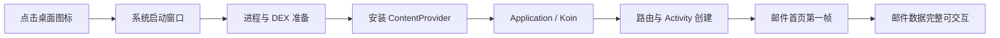

# Android 邮箱启动性能优化案例与操作手册

本文记录 KEMI Mail 在 2026-08-17 完成的一次 Android 冷启动性能专项。它既是本项目的变更说明，
也是一份可以迁移到其他 Android 应用的排查与优化手册。

本次专项首先解决“点击图标后白屏 6～8 秒，随后才进入邮箱”的真实性能问题，没有用长动画遮盖等待。
最终在同一台 USB 设备、同一份真实账户数据、同一个邮件首页入口下，启动耗时中位数从
**14,314 ms 降到 1,185.5 ms**，下降 **91.72%**，约为原来的 **12.07 倍速度**；P90 从
**16,129 ms 降到 1,284 ms**，下降 **92.04%**。

> 本文中的“启动耗时”默认指通过 `adb shell am start -W` 得到、并且最终 Activity 确认为
> `MessageHomeActivity` 的有效冷启动样本。本文会单独说明构建类型差异、无账户诊断数据和无效样本，
> 避免把不同口径的数据混在一起。

## 1. 问题与目标

### 1.1 用户看到的现象

原始体验是：

1. 用户点击桌面上的邮箱图标；
2. 屏幕长时间保持白色，看不到应用内容，也没有明确反馈；
3. 大约 6～8 秒甚至更久后才出现邮箱；
4. 后期加在 Activity 内的 Logo 或动画只出现 1～2 秒，因为它位于启动链路末端，无法覆盖前面的白屏。

最后一点非常关键：Activity 内的动画只能在 Activity 已经创建并能够绘制之后出现。若耗时发生在
进程创建、DEX 加载、`ContentProvider` 安装、`Application.attachBaseContext()` 或
`Application.onCreate()` 阶段，那么普通 View/Compose 动画根本没有执行机会。

### 1.2 本轮优先级

本轮按以下优先级执行：

1. 找到点击到邮件首页之间的真实耗时来源；
2. 缩短真实启动时间；
3. 建立 release-like 的可重复测试路径；
4. 在性能真正稳定后，再决定是否需要系统启动窗口、Logo、骨架屏或其他感知优化。

本轮没有把动画作为完成标准，也没有刻意延长 Logo 展示时间。

### 1.3 启动链路的正确心智模型



如果 C～E 阶段很慢，只在 F 阶段加动画就一定太晚。不同区段需要不同方法：

| 慢在哪一段 | 用户表现 | 优先排查 |
| --- | --- | --- |
| 系统启动窗口之前或期间 | 点击后白屏、Activity 尚未创建 | 包构建、进程创建、DEX、Provider |
| `Application` | 白屏，主 Activity 未开始绘制 | DI 图、同步磁盘 I/O、全局初始化 |
| Activity 到第一帧 | 已进入应用进程但内容迟迟不显示 | 布局、主题、首屏依赖、主线程任务 |
| 第一帧到完整内容 | 框架已显示但邮件列表晚 | 数据库、账户加载、同步、HTML/WebView |

## 2. 最终结果摘要

### 2.1 同设备、同账户 A/B 结果

最终验收使用同一台 USB Android 设备、保留相同账户和本地邮件数据，并验证最终页面为：

```text
com.fsck.k9.debug/com.fsck.k9.activity.MessageHomeActivity
```

| 指标 | 原始 Debug APK | 优化后 Performance APK | 改善 |
| --- | ---: | ---: | ---: |
| 有效样本数 | 9 | 10 | — |
| 中位数 | 14,314 ms | 1,185.5 ms | 下降 91.72% |
| P90（nearest-rank） | 16,129 ms | 1,284 ms | 下降 92.04% |
| 中位数速度倍率 | 1.00× | 12.07× | 约快 12.1 倍 |
| P90 速度倍率 | 1.00× | 12.56× | 约快 12.6 倍 |

优化包重新安装后的三次复核为 `2,245 / 1,164 / 1,173 ms`，最终目标 Activity 均为
`MessageHomeActivity`。首个安装后样本较高是常见现象，因此不能只报告第一次，也不能只选择最好的一次。

### 2.2 必须保留的归因限制

最终 A/B 是“用户原来实际测试的 Debug APK”与“release-like Performance APK”的整包对比，不是只改变一个变量的微基准。
这组数据能准确回答“用户手中的新包是否比原包快”，但不能把全部 91.72% 收益归因给某一行代码。

总收益同时包含：

- release 级 R8 压缩和优化；
- 资源压缩；
- `isDebuggable = false`；
- Startup Profile 带来的 DEX 布局变化；
- Provider 静态 DI 修复；
- Koin 依赖图收窄和延迟解析；
- 初始化顺序和无账户分支修复。

若要精确量化每项收益，必须基于同一个 Performance 构建逐项回退并重复测试。本文不会把整包结果伪装成单项代码的贡献。

## 3. 测量原则与有效样本定义

### 3.1 为什么必须使用 release-like 构建

Debug APK 适合开发，却不是可靠的启动性能验收对象。它与生产包在以下方面可能完全不同：

- 是否经过 R8 优化和代码压缩；
- 是否压缩资源；
- 是否可调试；
- DEX 数量、类布局和加载路径；
- Baseline Profile/Startup Profile 的打包和安装行为；
- 调试探针、StrictMode 或其他开发期逻辑。

因此本项目新增 `performance` build type。它继承 `release`，但使用 Debug 签名和 `.debug` application ID：

```kotlin
create("performance") {
    initWith(getByName("release"))
    signingConfig = signingConfigs.getByName("debug")
    applicationIdSuffix = ".debug"
    isDebuggable = false
    matchingFallbacks += listOf("release")
}
```

这个设计有两个用途：

- 以接近发布包的方式运行 R8、资源压缩和 Profile；
- 仍可覆盖安装到原 Debug 包上，保留真实账户数据，避免重新配置测试环境。

构建命令：

```shell
./gradlew :app-k9mail:kemiPerformanceApk
```

输出路径：

```text
app-k9mail/build/outputs/kemi/performance/KEMI-Mail-v<version>-performance-debug.apk
```

Performance APK 仍是 Debug key 签名的测试包，不能改名伪装成正式发布包，也不能作为生产签名产物分发。

### 3.2 同设备、同数据、同入口

一次可信 A/B 至少固定以下变量：

- 同一台物理设备；
- 同一系统版本、电量和大致温度状态；
- 同一 application ID 和账户数据；
- 同一个启动入口；
- 同样的强制停止和启动命令；
- 同样的有效性校验；
- 足够多的重复次数；
- 统一的中位数和 P90 算法。

本轮没有记录设备 USB 序列号，文档和日志中也不应保存账户地址、邮件标题、Token 或其他隐私数据。

### 3.3 推荐的 ADB 测试流程

以下命令展示最小流程。实际自动化脚本应在每轮中提取 `TotalTime`，并检查最终 resumed Activity：

```shell
adb shell am force-stop com.fsck.k9.debug
adb shell am start -W \
  -n com.fsck.k9.debug/com.fsck.k9.activity.MainActivity
adb shell dumpsys activity activities | rg "mResumedActivity|topResumedActivity"
```

每个样本必须同时满足：

1. `am start -W` 返回 `TotalTime`；
2. 最终进入 `MessageHomeActivity`；
3. 没有停在权限页、引导页、账户配置页、崩溃页或系统弹窗；
4. 启动前应用已被 `force-stop`；
5. 未在测试中途更换构建、账户或系统状态。

若只返回 `WaitTime`、没有 `TotalTime`，或最终只停在路由 `MainActivity`，样本必须标记无效并说明原因，不能按
0 ms、超时值或某个猜测值写入结果。

### 3.4 统计口径

- 中位数用于抵抗少量抖动和极端值；
- P90 用于反映用户较差但常见的启动体验；
- 首次安装后的第一次启动单独观察，不与稳定热身后的结果混为一谈；
- 不使用“最好的一次”作为对外结论；
- 记录原始值，确保任何人都能复算。

本轮 P90 使用 nearest-rank：将数据升序排列，取 `ceil(0.9 × n)` 位置的值。

### 3.5 编译模式限制

在普通、未 root 的 USB 设备上执行：

```shell
adb shell cmd package compile --reset com.fsck.k9.debug
```

会因权限不足失败，错误为 `SecurityException: Only the system can clear all profile data`。因此普通 USB
实机结果不能宣称是 Macrobenchmark 的 `CompilationMode.None`。

若需要严格区分无编译、部分编译和完整编译，请使用 AndroidX Macrobenchmark 管理测试包，或使用具备相应系统权限的专用测试设备。

## 4. 诊断过程：从假设到证据

### 4.1 先建立可追踪的 Application 区段

在 `BaseApplication` 和 `K9` 中加入 `android.os.Trace` 区段，而不是只在入口和出口打印日志。主要区段包括：

```text
BaseApplication.attachBaseContext
BaseApplication.startKoin
BaseApplication.onCreate
BaseApplication.superOnCreate
BaseApplication.initializeCore
BaseApplication.initializeK9
BaseApplication.initializeLegacyCore
BaseApplication.initializeAppLanguage
BaseApplication.observeNotificationChannels
BaseApplication.initializeTheme
BaseApplication.initializeMessageListWidget
BaseApplication.registerMessagingListeners
BaseApplication.observeProcessLifecycle
K9.initializeMailLib
K9.checkCachedDatabaseVersion
K9.resolveSettingsStorage
K9.loadPreferences
```

Trace 区段名称不包含账户地址、邮件内容或其他 PII，可以长期保留，便于后续 Perfetto 回归分析。

### 4.2 第一个关键发现：AndroidX Startup 不是主因

早期 Perfetto 样本中：

| 区段 | 观察耗时 |
| --- | ---: |
| `bindApplication` | 1,290.9 ms |
| `makeApplication` | 124.5 ms |
| AndroidX Startup | 约 8.2 ms |
| `OpenDexFilesFromOat` | 约 108 ms |
| Startup 前主线程间隙 | 约 934 ms |

另一个慢样本中 AndroidX Startup 约为 11.5 ms。实际发现的初始化器包括：

- EmojiCompat；
- ProcessLifecycle；
- ProfileInstaller；
- OkHttp `PlatformInitializer`。

这些初始化器当然仍可逐个审计，但 7～12 ms 不能解释数秒白屏。此前的优化指南或经验表格只能作为假设来源，
不能代替实际 trace。基于证据，本轮没有盲目删除所有 AndroidX Startup 初始化器。

WorkManager 的自动初始化在项目中本来就已移除并改为按需配置，因此也不是这次白屏的主要来源。

### 4.3 第二个关键发现：Provider 在 Application 之前触发静态 DI

Android 会在 `Application.onCreate()` 之前安装清单中的 `ContentProvider`。以下两个 Provider 原来在 Java
静态字段初始化阶段执行 Koin 查找：

```java
private static final GeneralSettingsManager generalSettingsManager =
    DI.get(GeneralSettingsManager.class);
```

受影响文件：

- `legacy/core/.../provider/AttachmentTempFileProvider.java`；
- `legacy/core/.../provider/DecryptedFileProvider.java`。

只要系统加载 Provider 类，就会解析 `GeneralSettingsManager`，即使本次启动根本不需要清理临时文件。
这会在 Activity 之前拉起大段 Koin 单例图，并把成本隐藏在 `installContentProviders` 或类初始化中。

修复方法不是移动所有 Provider，也不是新建另一个进程，而是删除静态 DI 字段，在真正需要读取调试设置时再调用局部 getter：

```java
private static GeneralSettingsManager getGeneralSettingsManager() {
    return DI.get(GeneralSettingsManager.class);
}
```

同时新增 `FileProviderClassInitializationTest`：在没有启动 Koin 的条件下直接实例化两个 Provider。旧代码会因静态初始化
触发 `ExceptionInInitializerError`，新代码可以安全完成类加载和实例化。

这类测试非常适合防止以后有人再次把 `DI.get()`、数据库访问或设置读取放回静态字段。

### 4.4 第三个关键发现：Koin 注册不慢，首次解析的对象图很慢

多次 trace 中 `BaseApplication.startKoin` 约为 89～91 ms。它有优化空间，但仍无法解释 3 秒以上停顿。
真正的慢点出现在 Koin 对象第一次解析时。

一个具有决定性的慢样本如下：

| Trace 区段 | 修复前 |
| --- | ---: |
| 整次启动 | 4,116 ms |
| `BaseApplication.attachBaseContext` | 91.386 ms |
| `BaseApplication.startKoin` | 90.768 ms |
| AndroidX Startup | 7.494 ms |
| `BaseApplication.onCreate` | 3,111.963 ms |
| `BaseApplication.initializeCore` | 3,085.153 ms |
| `BaseApplication.initializeK9` | 3,081.869 ms |
| `K9.initializeMailLib` | 0.141 ms |
| `K9.checkCachedDatabaseVersion` | 2.544 ms |
| `K9.resolveSettingsStorage` | 3,077.452 ms |
| `K9.loadPreferences` | 0.789 ms |

结论非常明确：不是读取偏好值耗时 3 秒，而是为了获得一个 legacy `Storage`，先解析了
`DefaultGeneralSettingsManager`。该对象构造函数组合了约 18 个设置管理器和 Flow，顺带创建了远超当前需要的依赖图。

原路径：

```text
K9.init()
  -> generalSettingsManager.storage
  -> 创建 DefaultGeneralSettingsManager
  -> 创建多组设置 manager / Flow / 相关单例
  -> 最后才拿到 legacy Storage
```

修复后直接使用已经拥有该 Storage 的 `Preferences`：

```kotlin
val storage = Preferences.getPreferences().storage
loadPrefs(storage)
```

同一 trace 口径下，修复后关键区段为：

| Trace 区段 | 修复后 | 降幅 |
| --- | ---: | ---: |
| `BaseApplication.initializeK9` | 53.339 ms | 98.27% |
| `K9.resolveSettingsStorage` | 48.536 ms | 98.42% |
| `K9.loadPreferences` | 0.810 ms | 基本不变 |

这说明“通过大对象获取一个小依赖”是根因之一。优化方向应是依赖最小化，而不是把同一段大图简单移动到另一个方法。

### 4.5 第四个关键发现：后台线程也能通过 DI 锁阻塞主线程

直接获取 `Preferences.storage` 后，某个无账户慢 trace 的整次进程仍有较长间隙。Perfetto 显示：

- 主线程在 `org.koin.core.instance.SingleInstanceFactory.get` 上等待 monitor；
- 等待约 2,328.839 ms；
- 锁持有者是 `DefaultDispatcher-worker-1`；
- 锁持有线程正在执行 `android.database.sqlite.SQLiteConnection.nativeExecute`。

调用链指向 `Core.restoreNotifications()`：它虽在 `Dispatchers.IO` 上启动，但解析 `NotificationController`
时拉起庞大的通知、设置和数据库对象图，并在 Koin 单例创建过程中持锁。随后主线程解析有交集的单例，只能等待后台线程完成 SQLite 操作。

因此：

```text
“放到后台协程” != “不会阻塞主线程”
```

只要主后台任务共享全局锁、Koin 单例锁、数据库连接池、文件锁或其他同步资源，后台初始化仍可能把主线程卡住。

对应修复包括：

- `MessagingController` 将 `NotificationController` 和 `NotificationStrategy` 改为 `Lazy<>`；
- `NotificationOperations` 只在真正执行通知操作时解析控制器；
- `Core.restoreNotifications()` 在账户为空时立即返回；
- 避免仅为构造 `MessagingController` 就创建完整通知链路。

### 4.6 第五个关键发现：主题只需要一个小设置分片

`ThemeManager` 原来依赖整个 `GeneralSettingsManager`，但实际只读取和更新
`DisplayCoreSettings`。这会让首屏主题初始化不必要地绑定到完整通用设置图。

修复后直接依赖 `DisplayCoreSettingsPreferenceManager`，并同步更新 app-common 的 Koin binding。
原则是：消费者应依赖它真正使用的最小接口或设置分片，而不是为了方便注入一个“总管理器”。

### 4.7 第六个关键发现：DEX 布局有收益，但不能单独解释全部慢点

原 `kemiRelease` Startup Profile 只有 13 条启动类规则，Koin 和大部分模块类位于第三个 DEX。扩展后：

- Startup Profile 共 723 条精确类规则；
- 覆盖应用入口、Koin runtime、实际 Koin module、合成 lambda 和启动 Provider；
- 相同规则同步到 `kemiRelease` 与 `kemiPerformance`；
- 规则使用精确类名，而不是宽泛通配符。

DEX 布局变化：

| 项目 | 修改前 | 修改后 |
| --- | ---: | ---: |
| `classes.dex` | 166,708 bytes | 224,068 bytes |
| `classes2.dex` | 569,448 bytes | 569,448 bytes |
| `classes3.dex` | 10,165,748 bytes | 10,148,376 bytes |
| 主 DEX 增量 | — | 约 57 KB |
| 主 DEX 内 Koin package | 很少 | 17 个 |
| 主 DEX 内 module 相关类 | 很少 | 97 个 |

一次手工 trace 中，扩展 DEX 布局后：

- 启动约 1,536 ms；
- `bindApplication` 从约 1,290.9 ms 降到约 792.7 ms；
- `makeApplication` 约 102.9 ms；
- AndroidX Startup 约 8.95 ms；
- Startup 前仍有约 600 ms 间隙。

说明 DEX 布局确实有帮助，但只改 Profile 仍不能消除对象图解析、锁竞争和磁盘 I/O。

Android 官方将两类 Profile 的职责区分为：Baseline Profile 主要让关键代码预编译，Startup Profile 主要帮助启动类和方法的
DEX 布局。参见 [Baseline Profiles and Startup Profiles](https://developer.android.com/topic/performance/baselineprofiles/difference-baseline-startup)。

## 5. Startup Profile 与基准测试的正确性

### 5.1 最大的 Profile 陷阱：采集了错误业务路径

原 Baseline Profile 生成器在设备没有配置账户时，找不到邮件列表就静默跳过 fling。测试表面上成功，实际采集的是账户引导页，
而不是用户真正关心的邮件首页。

错误路径生成的 Startup Profile 一度有 20,411 行。如果不检查业务路由就整份复制，会产生两个问题：

1. 主 DEX 被错误页面和无关代码膨胀；
2. 邮件首页真正需要的类仍可能不在理想位置。

本轮没有复制这份 20,411 行的错误 Profile，只提取了与路由无关且 trace 证明在启动阶段需要的 DI、module 和 Provider 精确类。

### 5.2 生成器必须对错误前置条件失败

`BaselineProfileGenerator` 现在等待真实的 `message_list` 或 `message_list_compose_view`。如果没有配置
release-like 账户或未进入邮件列表，会直接失败：

```text
Message list not found. Configure a release-like account before generating startup profiles.
```

“测试失败”比“静默生成错误优化数据”更安全。

### 5.3 基准测试必须要求 Profile 存在

`StartupBenchmark` 从：

```kotlin
BaselineProfileMode.UseIfAvailable
```

改成：

```kotlin
BaselineProfileMode.Require
```

这样缺失 Profile 会成为硬失败，不会悄悄退化为未使用 Profile 的测试。

### 5.4 R8 不接受所有通配写法

本轮尝试过宽泛的 Startup Profile 类/方法通配规则，R8 拒绝了部分写法。最终采用精确规则，并控制主 DEX 增量。

可复用建议：

- 优先从正确业务路径生成规则；
- 再结合 R8 输出和 APK/DEX 检查验证规则是否生效；
- 不要假设某种通配语法一定被当前 Android Gradle Plugin/R8 版本支持；
- 不要为了“覆盖完整”把几万行错误路由规则全部塞入主 DEX；
- 每次记录 DEX 体积和关键类位置，避免以启动速度换取不可控包体和安装成本。

## 6. 实施变更详解

### 6.1 建立 `performance` 构建类型

变更文件：`app-k9mail/build.gradle.kts`、`app-k9mail/README.md`。

作用：

- 继承 release 优化；
- 使用 Debug key，便于本地安装；
- 保持 `.debug` application ID，覆盖安装不清账户；
- 禁用 debuggable；
- 为缺少 performance 变体的依赖使用 release fallback；
- 复用 `src/release/kotlin`；
- 通过 `kemiPerformanceApk` 输出命名清晰的测试 APK。

### 6.2 扩展并同步 Startup Profile

变更文件：

- `app-k9mail/src/kemiRelease/generated/baselineProfiles/startup-prof.txt`；
- `app-k9mail/src/kemiPerformance/generated/baselineProfiles/startup-prof.txt`。

作用：把已经由 trace 和启动入口验证的关键类尽量安排到早期 DEX，同时保持精确、有限的规则集。

### 6.3 修正 Profile 生成和启动 Benchmark

变更文件：

- `app-k9mail-baseline-profile/.../BaselineProfileGenerator.kt`；
- `app-k9mail-baseline-profile/.../StartupBenchmark.kt`。

作用：确保测试的真的是邮件列表，并确保要求的 Baseline Profile 真实存在。

### 6.4 移除 Provider 静态 DI

变更文件：

- `legacy/core/.../provider/AttachmentTempFileProvider.java`；
- `legacy/core/.../provider/DecryptedFileProvider.java`；
- `legacy/core/src/test/.../provider/FileProviderClassInitializationTest.kt`。

作用：系统加载 Provider 类时不再提前创建完整设置依赖图；测试锁定“类初始化不依赖 Koin”这一约束。

### 6.5 缩短 K9 设置存储路径

变更文件：`legacy/core/.../K9.kt`。

作用：`K9.init()` 直接从 `Preferences` 获得 legacy `Storage`，不再通过完整
`GeneralSettingsManager` 绕行。

### 6.6 收窄 ThemeManager 依赖

变更文件：

- `core/ui/theme/manager/.../ThemeManager.kt`；
- `legacy/ui/base/.../KoinModule.kt`。

作用：主题初始化只解析 `DisplayCoreSettingsPreferenceManager`，避免拉起整套通用设置图。

### 6.7 延迟通知图

变更文件：

- `legacy/core/.../controller/KoinModule.kt`；
- `legacy/core/.../controller/MessagingController.java`；
- `legacy/core/.../controller/NotificationOperations.kt`；
- `legacy/core/.../Core.kt`。

作用：通知控制器和通知策略在实际通知操作发生时再创建；无账户时不恢复通知，避免后台抢占 Koin 锁和数据库资源。

### 6.8 修复被惰性初始化暴露的顺序依赖

变更文件：`legacy/core/.../Preferences.kt`。

延迟通知图后，`MessagingControllerTest` 最初有 21 个测试中的 20 个因 `Preferences.newAccount()` 空指针失败。
原因不是 Lazy 本身不可靠，而是旧的 eager 依赖图碰巧提前调用了账户加载，形成未声明的初始化副作用。

修复是在 `newAccount()` 的同步区段中检查 `accountsMap`，必要时调用 `loadAccounts()`。这让方法自己保证前置条件，
而不是依赖“别的单例也许已经创建过”。

这个案例提醒我们：把 eager 改成 lazy 后出现的测试失败通常是在暴露隐藏耦合，不能简单吞异常、补空值或回退优化。

### 6.9 增加可长期使用的 Perfetto 区段

变更文件：

- `app-common/.../BaseApplication.kt`；
- `legacy/core/.../K9.kt`。

所有区段都使用 `try/finally` 保证 `Trace.endSection()` 被调用，不记录 PII，也不改变业务异常行为。

## 7. 完整测试数据

### 7.1 原始 Debug APK

测试包：

```text
app-k9mail/build/outputs/apk/kemi/debug/app-k9mail-kemi-debug.apk
```

有效原始结果（ms）：

```text
13,520
16,129
14,314
14,529
12,383
15,076
13,410
15,668
11,622
```

升序：

```text
11,622, 12,383, 13,410, 13,520, 14,314, 14,529, 15,076, 15,668, 16,129
```

- 有效样本：9；
- 中位数：14,314 ms；
- P90：16,129 ms。

原始测试的第 5 轮没有 `TotalTime`，只有 `WaitTime=3,358 ms`，且最终只看到 `MainActivity`，没有进入
`MessageHomeActivity`。该轮被明确标记为无效并排除，没有拿它替代一个正常结果。

### 7.2 优化后 Performance APK

有效原始结果（ms）：

```text
2,194
1,284
1,246
1,128
1,134
1,126
1,143
1,209
1,181
1,190
```

升序：

```text
1,126, 1,128, 1,134, 1,143, 1,181, 1,190, 1,209, 1,246, 1,284, 2,194
```

- 有效样本：10；
- 中位数：`(1,181 + 1,190) / 2 = 1,185.5 ms`；
- P90：1,284 ms；
- 最大值：2,194 ms，也是该组安装后的首个样本。

### 7.3 复算公式

```text
中位数降幅 = 1 - 1,185.5 / 14,314 = 91.72%
中位数倍率 = 14,314 / 1,185.5 = 12.07×

P90 降幅 = 1 - 1,284 / 16,129 = 92.04%
P90 倍率 = 16,129 / 1,284 = 12.56×
```

### 7.4 早期无账户数据只能作为诊断证据

正式同账户验收之前，还在另一台网络连接设备或无账户状态做过多组排查：

| 阶段 | 中位数 | P90 | 说明 |
| --- | ---: | ---: | --- |
| 原始 Debug，无账户 | 4,702.5 ms | 5,962 ms | 实际是 onboarding 路由 |
| 初始 Performance，13 条规则 | 2,883.5 ms | 3,747 ms | 可看构建差异，不是邮件首页 |
| 扩展 DEX 规则 | 2,720.5 ms | 有明显噪声 | 中位数约再降 5.7% |
| Provider 修复后的某组 | 3,014.5 ms | 有明显噪声 | 未证明稳定整包收益 |

这些数据帮助发现方向和噪声，却不能作为最终“打开邮箱”验收，因为没有账户时应用走的是引导页。尤其是 Provider 修复后某一组
结果反而更慢，说明少量实机样本很容易受设备 I/O、温度、后台任务和编译状态影响。不能因为代码看起来合理，就挑一组有利数据宣布成功。

## 8. 本轮踩坑、原因与避免方法

### 8.1 把动画加在 Activity 里，位置太晚

**现象：** 白屏仍持续数秒，Logo 只在邮箱出现前闪 1～2 秒。

**原因：** 大部分耗时发生在 Activity 可绘制之前。

**避免：** 先用 Perfetto 划分进程、Provider、Application、Activity 和数据阶段。若只需要“点击立即反馈”，应使用系统 Splash/启动窗口；
但系统反馈不能替代真实性能优化。

### 8.2 用 Debug 包评价发布性能

**现象：** 开发包特别慢，优化结果不可复现或无法解释。

**原因：** Debug 与 release 在 R8、资源压缩、DEX、Profile 和调试状态上差异巨大。

**避免：** 建立可安装到测试账户上的 release-like Performance 变体；正式验收固定构建类型。

### 8.3 Benchmark 跑到了错误路由

**现象：** Profile 生成成功，但优化邮件首页效果有限。

**原因：** 测试设备没有账户，生成器找不到邮件列表后静默继续，实际采集 onboarding。

**避免：** 每个性能测试都要断言业务页面的稳定标识；前置数据缺失时硬失败。

### 8.4 相信经验表格，没有先看 trace

**现象：** 一开始容易把数秒问题归给 AndroidX Startup、WorkManager 或某个常见组件。

**原因：** 通用优化清单描述“可能慢”，不代表当前应用“就是它慢”。

**避免：** 先测量再修改。本轮 AndroidX Startup 只有约 7～12 ms，不是数秒根因。

### 8.5 把 `startKoin()` 与“所有 Koin 成本”等同

**现象：** `startKoin()` 只有约 90 ms，但应用仍在 Koin 相关栈上停顿几秒。

**原因：** 注册 module 与第一次解析 singleton 是两件事。Provider 静态字段、Application getter 和单例构造函数会在后续首次访问时拉起大图。

**避免：** 对 `get()` 调用点、构造函数依赖、静态字段和首次 singleton 创建分别打点。

### 8.6 认为后台协程一定不影响首帧

**现象：** 工作在 `DefaultDispatcher-worker-1` 执行，主线程却等待 2.3 秒。

**原因：** 后台线程持有 Koin singleton monitor，同时执行 SQLite；主线程需要同一组单例。

**避免：** 追踪锁的 owner/waiter；减少共享图；必要时把后台任务延迟到首帧后，而不只是换 Dispatcher。

### 8.7 在 ContentProvider 静态字段中做 DI

**现象：** 耗时出现在 Application 之前，普通 Application 打点看不到根因。

**原因：** Provider 由系统提前安装，Java/Kotlin 类初始化会立即执行静态 DI。

**避免：** Provider 类加载必须轻量；把 DI、数据库、文件扫描和设置读取放到实际方法调用中；增加无 DI 类初始化测试。

### 8.8 把错误路径生成的完整 Profile 全部复制

**现象：** Profile 有两万多行，看似“覆盖充分”。

**原因：** 大多数规则来自 onboarding；更多规则不等于更准确。

**避免：** 验证业务路由，检查主 DEX 增量，优先保留 trace 证明会早期使用的精确类。

### 8.9 假设 R8 支持所有通配规则

**现象：** 构建阶段拒绝 Startup Profile 规则。

**原因：** Profile 语法及当前 R8 解析能力有明确约束。

**避免：** 使用生成工具和精确规则；每次修改后真实构建 Performance APK，不只做文本检查。

### 8.10 只看最好值，不看原始数据和 P90

**现象：** 单次结果很快，但用户仍偶发长卡顿。

**原因：** Android 冷启动受页缓存、温度、后台服务、数据库和编译状态影响。

**避免：** 至少记录多次原始值、中位数、P90、最大值和无效样本原因。

### 8.11 在普通 USB 设备上声称重置了编译状态

**现象：** `cmd package compile --reset` 返回权限错误，却仍把结果标记成无 Profile/无编译。

**原因：** 清理全部 Profile 需要 system/root 权限。

**避免：** 如实记录权限和编译模式；需要严格实验时使用 Macrobenchmark 或专用设备。

### 8.12 延迟初始化后测试大量失败

**现象：** 20 个 `MessagingControllerTest` 因 `Preferences.newAccount()` 的隐含顺序依赖失败。

**原因：** 原 eager 图恰好执行了账户加载，业务代码错误地把副作用当成前置条件。

**避免：** 修复拥有该状态的方法，使其显式保证初始化；不要吞 NPE，也不要仅为让测试通过恢复整个大图。

### 8.13 把 Provider 移到独立进程作为默认方案

**风险：** 新进程会再次创建 Application/Koin，增加内存、进程管理、跨进程一致性和启动成本。

**原则：** 只有 Provider 具有真正独立且重型的生命周期、并有 trace 证据时才考虑独立进程。本轮按需解析已经解决静态 DI 问题。

### 8.14 盲目删除框架初始化器

**风险：** 可能破坏 Emoji、生命周期、ProfileInstaller、网络平台初始化或 WorkManager 行为。

**原则：** 逐个核对清单合并结果、初始化依赖和 trace 时间；没有证据就不删除。

### 8.15 用日志记录敏感业务数据

**风险：** 邮件客户端可能泄露地址、主题、正文、Token 或文件名。

**原则：** 启动追踪只记录固定区段名称和时长，不写 PII；分享 trace 前仍要检查进程、线程和自定义事件名称。

## 9. 可迁移到其他项目的标准流程

### 阶段 0：定义用户真正等待的终点

先回答以下问题：

- 用户点的是什么入口？
- “启动完成”是第一帧、首页框架、列表可滚动，还是数据完整？
- 是否需要真实登录态、账户、数据库和缓存？
- 冷启动、温启动、热启动是否分开？
- 最终 Activity/页面的可机器验证标识是什么？

如果终点定义错了，后面所有 Profile 和数字都可能无效。

### 阶段 1：建立 release-like 测试产物

检查项：

- [ ] 继承 release 的优化设置；
- [ ] 使用可本地安装的测试签名；
- [ ] 能保留或稳定恢复测试账户数据；
- [ ] 明确 APK 文件名、版本、签名和 application ID；
- [ ] 不把 Debug-signed 包当成生产发布包；
- [ ] 保存构建命令和产物摘要。

### 阶段 2：建立基线

每组至少记录：

- APK 版本和构建类型；
- 设备型号、系统版本和连接方式；
- 测试入口和最终页面；
- 原始 `TotalTime`；
- 无效样本及原因；
- 中位数、P90、最大值；
- 首次安装后样本；
- 是否使用了 Baseline Profile、具体编译模式是否可控。

### 阶段 3：用 Perfetto 切分大段，而不是猜方法

第一轮只需回答：

1. Activity 前还是 Activity 后？
2. 主线程在 Running、Runnable、Sleeping 还是 D 状态？
3. 是 CPU、磁盘 I/O、类加载、锁等待还是 Binder？
4. 锁由谁持有？持有者正在执行什么？
5. 哪个 100 ms 以上区段值得继续细分？

从 `Application`、核心初始化和首页路由开始加粗粒度 Trace，再逐步缩小。不要一次加入几百个日志点。

### 阶段 4：专项审计 Provider 和类初始化

建议搜索：

```shell
rg -n "class .*Provider|ContentProvider|FileProvider" .
rg -n "static final.*DI|get\(|by inject|lazyInject" .
rg -n "androidx.startup|InitializationProvider|WorkManagerInitializer" .
```

逐个检查：

- 静态字段是否访问 DI、数据库、SharedPreferences 或文件系统；
- `onCreate()` 是否同步扫描目录、删除文件或迁移数据；
- Provider 是否真的需要开机即初始化；
- 是否有清单 merger 带入的第三方 Provider；
- 类在无 DI 容器时能否安全加载。

### 阶段 5：专项审计 DI 对象图

对每个首屏 `get()` 追问：

- 当前只需要一个小值，是否却解析了聚合 manager？
- 构造函数是否包含数据库、Flow 组合、通知、网络或文件对象？
- singleton 创建时是否做真实工作？
- 能否注入更小的 API/设置分片？
- 能否使用 `Lazy<T>`，并保证业务方法自己维护初始化前置条件？
- 后台任务是否与主线程争同一个 singleton lock 或数据库？

优先消除“不需要却被创建”的对象，而不是微调构造函数中的几毫秒。

### 阶段 6：优化 Baseline Profile 和 Startup Profile

顺序建议：

1. 先保证生成器进入正确业务页面；
2. 缺少账户或页面时硬失败；
3. Baseline Profile benchmark 要求 Profile 存在；
4. 检查规则是否被 R8 接受；
5. 对比关键类所在 DEX 和 DEX 体积；
6. 同构建、同设备复测中位数和 P90；
7. 如果规则很多，审查是否采集了无关页面。

### 阶段 7：优化首帧之后的工作

当 Provider、Application 和 DEX 已经稳定后，再检查：

- 通知恢复是否能放到首帧后；
- 邮件同步是否抢数据库连接或主线程所需锁；
- HTML/WebView 是否只在打开邮件正文时初始化；
- 首页能否先显示缓存列表或轻量原生框架；
- 非首屏的 JNI、编辑器或富文本能力能否预热或按需加载。

### 阶段 8：建立回归门槛

建议为固定设备和固定账户夹具保存基准，至少监控：

- TTID（Time To Initial Display）；
- TTFD（Time To Full Display，如果应用能可靠上报）；
- `am start -W` 的中位数和 P90；
- `Application` 各 Trace 区段；
- 主线程最长锁等待；
- 主 DEX 大小和关键启动类位置。

以本次设备为起点，可以暂设“中位数不高于 1.5 秒、P90 不高于 2.0 秒”为本地回归预警线，
但它不是所有设备的产品 SLA。正式 SLA 应覆盖低端设备、不同数据库大小、不同账户数量和系统版本。

## 10. 下一阶段的感知优化建议

真实启动降到约 1.2 秒后，不再需要用固定 7～8 秒动画掩盖等待。如果仍希望点击后立即有品牌反馈，应按以下顺序做：

1. 使用 Android 系统 Splash/启动窗口提供点击后立即出现的静态 Logo；
2. Activity 创建后尽快提交轻量原生第一帧；
3. 首帧可以展示邮箱框架或骨架列表，但不能阻塞主线程等待完整数据；
4. 通知恢复、同步检查、HTML/WebView 等放到首帧后或真正使用时；
5. 从系统 Splash 到应用首帧的背景色、Logo 尺寸和位置保持连续，避免闪白或跳变；
6. 动画只表达“正在进入”，不设置人为最短 7～8 秒，也不隐藏新的性能回退。

KOffice 类应用常采用的思路也适用于这里：系统启动窗口保证立即反馈；重型引擎在用户真正打开文档前预热；点击后先提交轻量原生首帧，
再并行准备文件，最后切换到完整编辑器。邮箱对应的重型部分通常是 DI 大图、数据库、同步、通知、WebView/HTML 或 JNI，
但是否预热必须由当前产品使用路径和 trace 决定。

## 11. 验证记录

本轮与启动修改直接相关的验证包括：

```shell
./gradlew \
  :legacy:core:spotlessCheck \
  :legacy:core:testDebugUnitTest \
  --tests com.fsck.k9.controller.MessagingControllerTest \
  --tests com.fsck.k9.provider.FileProviderClassInitializationTest
```

结果：`BUILD SUCCESSFUL`，相关 605 个 Gradle task 完成；此前单独执行 Provider 测试也通过。

Performance APK 多次通过以下任务构建，最终构建成功：

```shell
./gradlew :app-k9mail:kemiPerformanceApk
```

安装后完成了同设备、同账户的 10 次 A/B 组测试和重新安装后的 3 次复核。用户实际测试反馈为启动速度“大大提高”。

本轮没有执行完整 `connectedAndroidTest`。本文只记录实际完成的验证，不把未运行的任务写成已通过。

## 12. 文件变更索引

| 文件或目录 | 目的 |
| --- | --- |
| `app-common/.../BaseApplication.kt` | 增加 Application 启动 Trace 区段 |
| `app-k9mail/build.gradle.kts` | 新增 release-like `performance` build type 和打包任务 |
| `app-k9mail/README.md` | 说明 Performance APK 的构建、签名和用途 |
| `app-k9mail/src/kemiRelease/.../startup-prof.txt` | release Startup Profile |
| `app-k9mail/src/kemiPerformance/.../startup-prof.txt` | Performance Startup Profile |
| `app-k9mail-baseline-profile/.../BaselineProfileGenerator.kt` | 强制进入真实邮件列表 |
| `app-k9mail-baseline-profile/.../StartupBenchmark.kt` | 强制要求 Baseline Profile |
| `legacy/core/.../provider/*.java` | 移除 Provider 静态 DI |
| `legacy/core/src/test/.../FileProviderClassInitializationTest.kt` | 防止 Provider 类初始化回归 |
| `legacy/core/.../K9.kt` | 缩短 legacy Storage 获取路径并加 Trace |
| `legacy/core/.../Core.kt` | 无账户时跳过通知恢复 |
| `legacy/core/.../Preferences.kt` | 消除隐式账户初始化顺序依赖 |
| `legacy/core/.../controller/*` | 延迟通知控制器与策略对象图 |
| `core/ui/theme/manager/.../ThemeManager.kt` | 依赖最小显示设置分片 |
| `legacy/ui/base/.../KoinModule.kt` | 更新 ThemeManager DI binding |

## 13. 复用检查清单

### 测量前

- [ ] 明确点击入口、目标页面、TTID/TTFD 定义；
- [ ] 使用 release-like 包；
- [ ] 固定设备、账户、数据库和测试命令；
- [ ] 能机器验证最终页面；
- [ ] 记录编译/Profile 状态的真实限制。

### 定位时

- [ ] 用 Perfetto 判断 Activity 前后；
- [ ] 给 Application 和核心初始化加 Trace；
- [ ] 检查 Provider、清单 initializer 和静态字段；
- [ ] 区分 DI 注册与 singleton 首次解析；
- [ ] 检查主线程锁等待及后台锁持有者；
- [ ] 检查 SQLite、磁盘 D 状态和 DEX 类布局。

### 修改时

- [ ] 消除不必要的 eager graph；
- [ ] 依赖最小 API 或设置分片；
- [ ] Lazy 后补齐显式初始化前置条件；
- [ ] Profile 只覆盖正确业务路径；
- [ ] 不盲删初始化器、不盲分新进程；
- [ ] Trace/日志不含 PII。

### 验收时

- [ ] 保存全部原始值；
- [ ] 排除并解释无效样本；
- [ ] 报告中位数、P90、最大值和安装后首轮；
- [ ] 校验最终 Activity；
- [ ] 明确 Debug、Performance、Release 的差异；
- [ ] 说明哪些测试运行过、哪些没有；
- [ ] 用户真实设备复测通过。

## 14. 最终经验

这次优化最重要的经验不是某一个 API，而是以下顺序：

1. **先定义真实业务终点。** 跑错页面会让 Profile、Benchmark 和结论全部失真。
2. **先建立 release-like 构建。** Debug 包不能代表用户最终启动性能。
3. **用 Perfetto 找最长区段。** 通用清单是线索，不是证据。
4. **警惕 Activity 之前的工作。** Provider、类初始化和 DEX 最容易制造“动画也覆盖不到”的白屏。
5. **优化 DI 的首次解析图，而不只看容器启动。** 一个小 getter 可能间接创建几十个对象、Flow 和数据库组件。
6. **后台任务仍可能阻塞主线程。** 必须检查共享锁和数据库资源。
7. **Profile 必须来自正确路径并控制规模。** 更多规则不等于更快。
8. **Lazy 会暴露旧代码的隐藏顺序依赖。** 应修复契约，而不是掩盖失败。
9. **报告原始数据和限制。** 不挑最好值，不把整包收益冒充单项收益。
10. **真实性能解决后再做动画。** 系统 Splash 和轻量首帧用于提升连续性，不用于掩盖 7～8 秒回退。

如果未来再次出现点击后白屏，应先比较当前 Perfetto 区段、DEX 布局和固定设备基线，再决定是否是本次问题复发。
只有证据指向同一根因时，才复用同一项修复；否则复用的是本文的方法，而不是机械复制代码。
